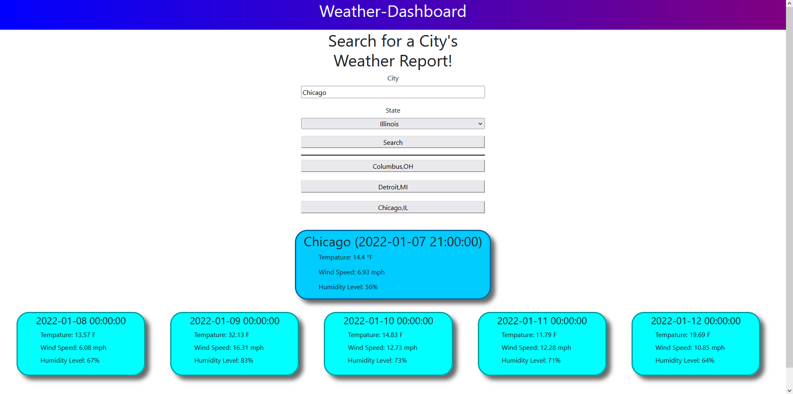

# Weather Dashboard

## Table of Contents
- [Description](#Description)
- [Usage](#Usage)
- [Contributing](#Contributing)
- [Links](#Links)
- [Screenshots](#Screenshots)
- [Questions](#Questions)
    
## Description
- This application shows the current day weather for a selected city, and a 5 day forecast. It keeps your history, however selecting the button to repeat search history is not working.
    

## Usage
- Type in the city of yoru choosing, and select the state that the city resides in.
- To clear your history, right click and inspect element, then go to storage, then clear your local storage.

## Contributing
- Christian Tanicala

## Links
- https://chtanicala.github.io/Weather-Dashboard/(Deployed)
- https://github.com/Chtanicala/Weather-Dashboard (Repository)

## Screenshots
- 

    
## Questions
- Contact username, Chtanicala, on Github
- Email christian.tanicala@gmail.com